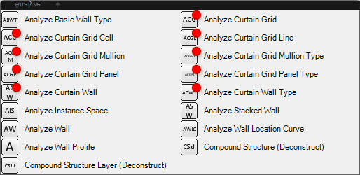
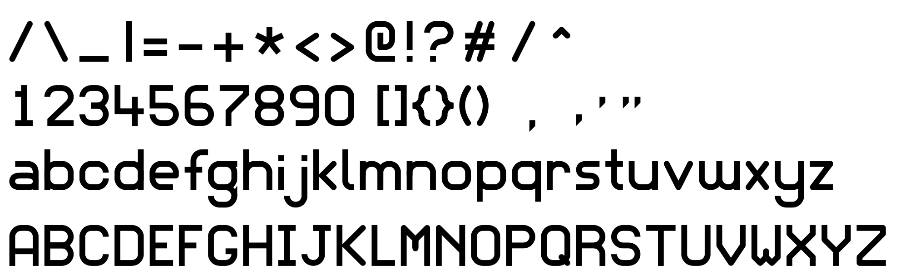

This directory contains the graphic files associated with this project.

- Source files are generated using [Affinity Designer](https://affinity.serif.com/en-gb/designer/) and is exported to PNG and SVG
- The windows icon file is generated using [IcoFX](https://icofx.ro/)

## Project Logo

- `logo.png`
- `logo.svg`

## Newsletters (`newsletters/`)

Highlighting new components:

- `new-components-highlight.afphoto`

## YouTube Channel (`yt-channel/`)

Banner files are

- `youtube-banner.afphoto`
- `youtube-banner.png`

Video thumbnails source file is

- `video-thumbnails.afphoto`

## Grasshopper Component Icons  (`gh-component-icons/`)

- `gh-font.svg`: the basic font vector graphics for component icons

