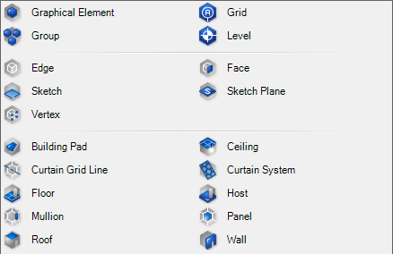

This directory contains the graphic files associated with this project.

- Source files are generated using [Affinity Designer](https://affinity.serif.com/en-gb/designer/) or [Affinity Photo](https://affinity.serif.com/en-gb/photo/) and is exported to PNG and SVG
- [svgexport](https://github.com/shakiba/svgexport) can be used to safely batch-convert SVG files to other image file formats. See link for installation and usage
- The windows icon files (`*.ico`) are generated using [IcoFX](https://icofx.ro/)

**Note**

No matter which authoring software that is used to generate vector graphics, always save a copy of the design as SVG. This should be the source for generating other image formats

# Project Logo

- `logo.png`
- `logo.svg`

# Newsletters

Highlighting new components:

- `newsletters/new-components-highlight.afphoto`

# YouTube Channel

Banner files are

- `yt-channel/youtube-banner.afphoto`
- `yt-channel/youtube-banner.png`

Video thumbnails source file is

- `yt-channel/video-thumbnails.afphoto`

# Grasshopper Component Icons

- `gh-icons/gh-font.svg`: the basic font vector graphics for component icons
- `gh-icons/rir-styles.afdesign`: styles for icons
  - `gh-icons/rir-styles.svg`: styles for icons in SVG
- `gh-icons/params`: parameter icons in SVG
  - `gh-icons/params/src`: source files for parameter icons
- `gh-icons/comps`: component icons in SVG
  - `gh-icons/comps/src`: source files for component icons

## Icon Design Guidelines

See [Grasshopper Icons](https://developer.rhino3d.com/guides/grasshopper/grasshopper-icons/) on general guidelines for designing parameter and component icons for Grasshopper

- Use the font file listed above to grab vector graphics for the fonts. It is ok to adjust the final font vector graphics to be pixel perfect
- Revit Primitives have a cube-like frame that resembles the primitives in Grasshopper. The cube is grayed-out and looks like a space when dealing with 3d primitives. The blue cube is used for 2d or conceptual primitives. Category, Family, and Type are represented conceptually as 3 sides of the Revit data organization with different colors

    

- Colors denote type of operation (Query, Analyze, Modify, Create)
- Icons for various categories are differentiated by their shape. The color denotes the type of operation the component performs on that category
- Where possible use shapes similar to Grasshopper icons e.g. Material primitive icon uses the egg shape of Grasshopper materials