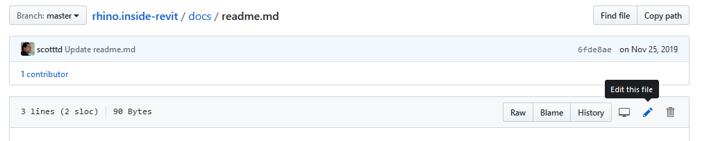
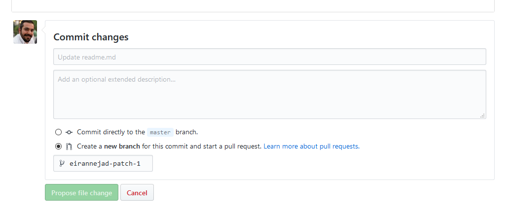

- [Rhino.Inside.Revit Wiki](#rhinoinsiderevit-wiki)
- [Contributing to the Wiki](#contributing-to-the-wiki)
  - [Applying Minor Changes Using the Github Editor](#applying-minor-changes-using-the-github-editor)
  - [Clone, Revise, Submit Pull-Request](#clone-revise-submit-pull-request)
    - [Getting git](#getting-git)
    - [Cloning the Repository](#cloning-the-repository)
    - [Installing Ruby](#installing-ruby)
      - [Windows](#windows)
      - [macOS](#macos)
    - [Installing Jekyll](#installing-jekyll)
    - [Building the Wiki using Jekyll](#building-the-wiki-using-jekyll)
    - [Make Necessary Changes](#make-necessary-changes)
    - [Publishing the Changes](#publishing-the-changes)
- [Understanding Wiki Source Files](#understanding-wiki-source-files)
  - [Page Metadata](#page-metadata)
  - [Page Layouts](#page-layouts)
  - [Adding a New Langauge](#adding-a-new-langauge)
  - [Adding a New Wiki Version](#adding-a-new-wiki-version)

# Rhino.Inside.Revit Wiki

This repo contains the contents of https://mcneel.github.io/rhino.inside-revit/

- The site is hosted on [GitHub Pages](https://pages.github.com/) which uses a static site generator called [Jekyll](http://jekyllrb.com/).
- The page are written using Markdown (specifically [Kramdown](http://kramdown.gettalong.org/syntax.html)) syntax
- The contents of the Wiki are stored under `pages/` and are grouped by locale (e.g. `en` for English) and Rhino.Inside.Revit versions e.g. `en/beta/getting-started.md` for **Getting Started** article in **English** for **Beta** release.
- All static resources, e.g. image or Revit models are stored under `static/`
- Style sheets are under `css/`. Please coordinate any changes with the Authors


# Contributing to the Wiki

There are multiple ways to edit the pages hosted in this repo. There are pros and cons to each approach. Each of the items listed here, is described in detail in sections below.

- Edit the Markdown (`*.md`) files directly on GitHub using the Github online editor
- Clone the repository on your machine, edit the Markdown files, and commit back to the repo

## Applying Minor Changes Using the Github Editor

This approach is great for making minor changes to a few pages on the wiki (e.g. fixing a typo or a broken link). However, you need to have write access to the repo to be able to change the pages directly on github.

To quickly edit the page, browse to the page on github, then click on the pencil button to start the edit process:



Make your changes, following the document structure and the Markdown syntax. Then scroll to the button of the page, fill in the title textbox (single line) with a short description of the changes, and then fill in the extended description textbox with detailed information about the change if necessary.

Finally, you can either choose to commit to master, or commit to a separate branch and create a pull-request. In most cases it is safer to create a new branch and submit a pull-request.



## Clone, Revise, Submit Pull-Request

The most popular, and by far, the most flexible approach is to clone the repository on your machine and make the necessary changes to the content. This approach is great for making lots of changes and adding new content to the wiki (e.g. if you want to translate the wiki to your own language).

This step requires basic knowledge of `git` and github. The initial setup for this approach might also look a bit complicated. The steps below will take you through the one-time initialization that is required to be able to test your changes before commiting to the source repo.

### Getting git

**git** is a utility libray and has an official command-line-utility (CLI) that could be downloaded from the [git website](https://git-scm.com/). The git library is used in many Graphical User Interface (GUI) to provide a more approachable interface to git. A few of these utiliies are listed here:

- [Original git CLI](https://git-scm.com/)
  - [git Cheat Sheet](https://training.github.com/kit/downloads/github-git-cheat-sheet.pdf) will be helpful when working with the git CLI
- [SourceTree](https://www.sourcetreeapp.com/)
- [GitKraken](https://www.gitkraken.com/)
- [Git Fork](https://git-fork.com/)
- [GitHub for Mac](https://mac.github.com/)
- [GitHub for Windows](https://windows.github.com/)

These utilities have very comparable feature sets. Choose one that you are comfortable with. For the sake of this tutorial, we focus on the git CLI.

### Cloning the Repository

Once you have installed the git CLI, open a shell (e.g. Powershell in Windows, or `bash` in macOS) and navigate to a safe directory. Then clone the repo using the command below. If you do not have write access to the original repo, you need to `fork` the repository using Github and then clone your own forked repo on your machine. This will allow you to make the changes and publish them back to your own fork on github, and create a pull-request from your fork, to the original repository.

```
git clone https://github.com/mcneel/rhino.inside-revit.git
```


### Installing Ruby

Jekyll is a static site generator that is written in ruby. We need to intall Ruby first

#### Windows

- [Download the latest Ruby installer](http://rubyinstaller.org/downloads/) for your machine architecture (x86 or x64). Make sure to download the installer that includes the Dev kit. See the linkes under **WITH DEVKIT** section on the download page.Jekyll won't be fully functional without the dev kit.
- At the *Installation Destination and Optional Tasks* dialog, make sure to check the **Add Ruby executable to your PATH** box.
- Install Ruby to the default path (usually `C:\RubyXX-xXX`)

After the installation is complete, open a shell and navigate to the install path and run the commands below to initialize the developer kit.

```
cd <ruby-install-path-on-your-machine>
ruby dk.rb init
ruby dk.rb install
```

#### macOS

macOS is shipped with Ruby, however it's not wise to mess around with this installation. macOS has a pretty awesome package manager called [Homebrew](https://brew.sh/). We will use this package manager to easily install Ruby. First install homebrew using the directions on the Homebrew homepage (macOS will prompt you to install the Xcode Command Line Tools, if you have not already installed. This is normal)

Now we can install Ruby.

```
brew install ruby
```


### Installing Jekyll

Now we will install Jekyll. Github provides the same version of Jekyll as exists on the GitHub Pages servers. This ensures we aren't accidentally using features that have either been deprecated or simply don't exist yet! We will also install a few utilities that are provided by github to make the process easier.

Navigate to the clone directory and run the commands below.

```
gem install jekyll
gem install github-pages
gem install wdm
```

### Building the Wiki using Jekyll

In this step we will ask Jekyll to parse the wiki source files (e.g. Markdown files and configurations), and build the final static website.

Using a shell, navigate to the local clone directory. Then run the command below.

```
jekyll build
```

Alternatively, or in case of errors in command above, you can also run

```
bundle exec jekyll build
```

Jekyll will parse the file and will build a static version of Wiki into `_site/`. Github later uses this directory to serve the Wiki to the users. To preview the website, run the command below

```
jekyll serve
```

Alternatively, or in case of errors in command above, you can also run

```
bundle exec jekyll serve
```

Jekyll will build the website, and will run a local web server and, by default, startes listening to `http://localhost:4000`. You can open a browser and navigate to this address to see the website preview. Remember that this is a preview, built from your local changes. We still need to publish the changes to the source repo.

Shutdown the server by pressing CTRL-C in terminal.

### Make Necessary Changes

Now you can make the necessary changes to the Wiki pages

### Publishing the Changes

Once you are done with your changes, submit a pull-request through Github. If you don't have write access to the repo, an author will review your pull-request and will merge or comment. Please follow the pull-request untill your changes are completely merged into the master.

# Understanding Wiki Source Files

As mentioned above, the wiki is built using [Jekyll](http://jekyllrb.com/) and is hosted on [GitHub Pages](https://pages.github.com/)

The structure of the source is as explained below:

- `_layouts/` contains Jekyll page layouts of various types (e.g. full-width page vs page with sidebar)
- `_includes/` contains Jekylll page fragments used across various page layouts
- `pages/` contains the Wiki contents grouped by langauge and wiki version
- `static/` contains all static files
  - `css/` contains all stylesheets for generated pages
  - `images/` contains all images used across the wiki contents
- `_config.yml` Jekyll site configs file (see the config file for more information on each available setting)
- `GemFile*` Ruby gemfile listing the ruby dependencies
- `index.md` Root of the Wiki. It redirects the visitor to default langauge and Wiki version (defaults are set in the site configs file)
- `readme.md`: This Markdown document

## Page Metadata

Each page must contain some required metadata at the top of the page.

```
---
title: Components for Revit
order: 2
---
```

Required metadata are

- **Title**
- **Order** (if page is part of a list of similar content e.g. `samples/`)
- **Language** Set automatically by site configuration. do not set manually
- **Version** Set automatically by site configuration. do not set manually
- **Category** Set automatically by site configuration. do not set manually
- **Layout** Default layout is set automatically by site configuration. override only when your page layout is different from default. See site config file for default layout

## Page Layouts

There are there main layouts created for this wiki. You can specify the layout using the `layout:` directive on the page metadata e.g. `layout: page-h2-toc`

- `_layouts/page-fullwidth.html` fills all the horizontal space of a wiki page
- `_layouts/page-h2-toc.html` page with sidebar listing `h2 (##)` and `h3 (###)` elements inside page contents
- `_layouts/page-list-toc.html` page with sidebar listing all pages of the same category, version, and language. Each active page also lists `h2 (##)` elements inside page contents as secondary links

## Adding a New Langauge

To add a new language to the Wiki, a translator generally starts with the English version of the wiki and translates the content. Copy the `pages/_en` content to a new directory under `pages/` with your [ISO 693-1 langauge code](https://en.wikipedia.org/wiki/List_of_ISO_639-1_codes). For example to translate the English wiki to Persian, copy the `pages/_en` content to `pages/_fa`

Now open the site config file and add the new language to the Jekyll site collections:

```yaml
collections:
  en:
    output: true
    permalink: /en/:path

  fa:
    output: true
    permalink: /fa/:path
```

Instead of adding `language: fa` to the metadata for every single page, we will edit the site config file to add this metadata to the new pages automatically based on their location in directory structure.

Open the site configurations and add a new scope under `defaults:` for the new langauge:

```yaml
defaults:
  - scope:
      path: ""
      type: en
    values:
      language: en

  - scope:
      path: ""
      type: fa
    values:
      language: fa
```

Jekyll site config file automatically sets the correct version and categories on the new page.

Once the new language directory is created, open each page under each version and translate the page contents.


## Adding a New Wiki Version

To add a new version to the Wiki, browse under the site contents for your langauge and create a new version directory following the X.X format. For example to add version `1.5` to the wiki for English langauge we need to create `pages/_en/1.5/` directory.

Instead of adding `version: 1.5` to the metadata for every single page, we will edit the site config file to add this metadata to the new pages automatically based on their location in directory structure.

Open the site configurations and add the new version to the list of site versions:

```yaml
# site versions. ordered from most recent to oldest
versions:
  - 1.5
  - 1.0
  - beta
```

Add a new scope under `defaults:` for the new version:

```yaml
defaults:
  - scope:
      path: "pages/*/1.0"
    values:
      version: 1.0

  - scope:
      path: "pages/*/1.5"
    values:
      version: 1.5
```

Jekyll site config file automatically sets the correct layout and categories on the new page.

Copy the wiki contents from the previous version to this directory and edit the pages as desired.
