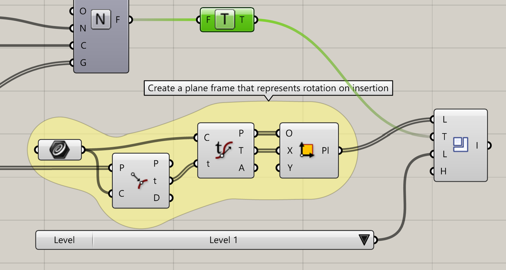
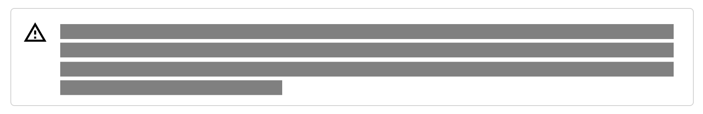
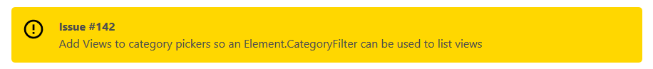
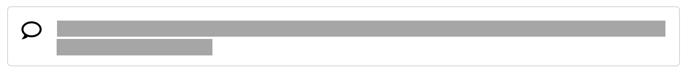
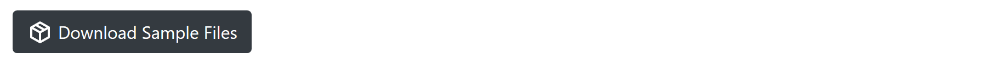
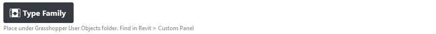
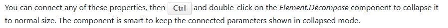
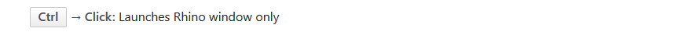

- [Rhino.Inside.Revit Wiki](#rhinoinsiderevit-wiki)
- [Contributing to the Wiki](#contributing-to-the-wiki)
  - [Applying Minor Changes Using the GitHub Editor](#applying-minor-changes-using-the-github-editor)
  - [Clone, Revise, Submit Pull-Request](#clone-revise-submit-pull-request)
    - [Getting git](#getting-git)
    - [Cloning the Repository](#cloning-the-repository)
    - [Installing Ruby](#installing-ruby)
      - [Windows](#windows)
      - [macOS](#macos)
    - [Installing Jekyll](#installing-jekyll)
    - [Building the Wiki using Jekyll](#building-the-wiki-using-jekyll)
    - [Make Necessary Changes](#make-necessary-changes)
    - [Spell Check](#spell-check)
    - [Publishing the Changes](#publishing-the-changes)
- [Online Experience](#online-experience)
- [Understanding Wiki Source Files](#understanding-wiki-source-files)
  - [Page Metadata](#page-metadata)
  - [Page Layouts](#page-layouts)
  - [Adding a New Language](#adding-a-new-language)
  - [Adding a New Wiki Version](#adding-a-new-wiki-version)
  - [Adding Button-Specific Documentation](#adding-button-specific-documentation)
  - [Adding Component-Specific Documentation](#adding-component-specific-documentation)
  - [Adding Release Notes](#adding-release-notes)
- [Wiki Formatting Conventions](#wiki-formatting-conventions)
  - [Frequently User Terms](#frequently-user-terms)
  - [Linking Other Pages](#linking-other-pages)
  - [Linking Images](#linking-images)
  - [Grasshopper Screenshots](#grasshopper-screenshots)
  - [Linking Videos](#linking-videos)
  - [Adding Email Links](#adding-email-links)
  - [Pre-defined Blocks](#pre-defined-blocks)
    - [Work-in-Progress Block](#work-in-progress-block)
    - [Revit API Link Block](#revit-api-link-block)
    - [Warning Note Block](#warning-note-block)
    - [GitHub Issue Note Block](#github-issue-note-block)
    - [Bubble Note Block](#bubble-note-block)
    - [API Note Block](#api-note-block)
    - [Locale Note Block](#locale-note-block)
    - [Download Package Block](#download-package-block)
    - [Download Component Block](#download-component-block)
    - [Release Header Block](#release-header-block)
    - [Keyboard Key (Inline)](#keyboard-key-inline)
    - [Keyboard Shortcut Block](#keyboard-shortcut-block)
- [Sample Pages](#sample-pages)
- [Data Sources](#data-sources)
  - [Rhinoceros Tab Button List](#rhinoceros-tab-button-list)
  - [Grasshopper Component List](#grasshopper-component-list)

# Rhino.Inside.Revit Wiki

This repo contains the contents of https://mcneel.github.io/rhino.inside-revit/

- The site is hosted on [GitHub Pages](https://pages.github.com/) which uses a static site generator called [Jekyll](http://jekyllrb.com/).
- The page are written using Markdown (specifically [Kramdown](http://kramdown.gettalong.org/syntax.html)) syntax
- The contents of the Wiki are stored under `pages/` and are grouped by locale (e.g. `en` for English) and Rhino.Inside.Revit versions e.g. `en/beta/getting-started.md` for **Getting Started** article in **English** for **Beta** release.
- All static resources, e.g. image or Revit models are stored under `static/`
- Front-end assets are under `assets/`. Please coordinate any changes with the authors


# Contributing to the Wiki

There are multiple ways to edit the pages hosted in this repo. There are pros and cons to each approach. Each of the items listed here, is described in detail in sections below.

- Edit the Markdown (`*.md`) files directly on GitHub using the GitHub online editor
- Clone the repository on your machine, edit the Markdown files, and commit back to the repo

## Applying Minor Changes Using the GitHub Editor

This approach is great for making minor changes to a few pages on the wiki (e.g. fixing a typo or a broken link). However, you need to have write access to the repo to be able to change the pages directly on GitHub.

To quickly edit the page, browse to the page on GitHub, then click on the pencil button to start the edit process:


Make your changes, following the document structure and the Markdown syntax. Then scroll to the button of the page, fill in the title textbox (single line) with a short description of the changes, and then fill in the extended description textbox with detailed information about the change if necessary.

Finally, you can either choose to commit to master, or commit to a separate branch and create a pull-request. In most cases it is safer to create a new branch and submit a pull-request.


## Clone, Revise, Submit Pull-Request

The most popular, and by far, the most flexible approach is to clone the repository on your machine and make the necessary changes to the content. This approach is great for making lots of changes and adding new content to the wiki (e.g. if you want to translate the wiki to your own language).

This step requires basic knowledge of `git` and GitHub. The initial setup for this approach might also look a bit complicated. The steps below will take you through the one-time initialization that is required to be able to test your changes before committing to the source repo.

### Getting git

**git** is a utility library and has an official command-line-utility (CLI) that could be downloaded from the [git website](https://git-scm.com/). The git library is used in many Graphical User Interface (GUI) to provide a more approachable interface to git. A few of these utilities are listed here:

- [Original git CLI](https://git-scm.com/)
  - [git Cheat Sheet](https://training.github.com/kit/downloads/github-git-cheat-sheet.pdf) will be helpful when working with the git CLI
- [SourceTree](https://www.sourcetreeapp.com/)
- [GitKraken](https://www.gitkraken.com/)
- [Git Fork](https://git-fork.com/)
- [GitHub for Mac](https://mac.github.com/)
- [GitHub for Windows](https://windows.github.com/)

These utilities have very comparable feature sets. Choose one that you are comfortable with. For the sake of this tutorial, we focus on the git CLI.

### Cloning the Repository

Once you have installed the git CLI, open a shell (e.g. PowerShell in Windows, or `bash` in macOS) and navigate to a safe directory. Then clone the repo using the command below. If you do not have write access to the original repo, you need to `fork` the repository using GitHub and then clone your own forked repo on your machine. This will allow you to make the changes and publish them back to your own fork on GitHub, and create a pull-request from your fork, to the original repository.

```
git clone https://github.com/mcneel/rhino.inside-revit.git
```


### Installing Ruby

Jekyll is a static site generator that is written in ruby. We need to install Ruby first

#### Windows

- [Download the latest Ruby installer](http://rubyinstaller.org/downloads/) for your machine architecture (x86 or x64). Make sure to download the installer that includes the Dev kit. See the links under **WITH DEVKIT** section on the download page.Jekyll won't be fully functional without the dev kit.
- At the *Installation Destination and Optional Tasks* dialog, make sure to check the **Add Ruby executable to your PATH** box.
- Install Ruby to the default path (usually `C:\RubyXX-xXX`)

After the installation is complete, open a shell and navigate to the install path and run the commands below to initialize the developer kit.

```
cd <ruby-install-path-on-your-machine>
ruby dk.rb init
ruby dk.rb install
```

#### macOS

macOS is shipped with Ruby, however it's not wise to mess around with this installation. macOS has a pretty awesome package manager called [Homebrew](https://brew.sh/). We will use this package manager to easily install Ruby. First install homebrew using the directions on the Homebrew homepage (macOS will prompt you to install the Xcode Command Line Tools, if you have not already installed. This is normal)

Now we can install Ruby.

```
brew install ruby
```


### Installing Jekyll

Now we will install Jekyll. GitHub provides the same version of Jekyll as exists on the GitHub Pages servers. This ensures we aren't accidentally using features that have either been deprecated or simply don't exist yet! We will also install a few utilities that are provided by GitHub to make the process easier.

Navigate to the clone directory and run the commands below.

```
gem install jekyll
gem install github-pages
gem install wdm
```

### Building the Wiki using Jekyll

In this step we will ask Jekyll to parse the wiki source files (e.g. Markdown files and configurations), and build the final static website.

Using a shell, navigate to the local clone directory. Then run the command below.

```
jekyll build
```

Alternatively, or in case of errors in command above, you can also run

```
bundle exec jekyll build
```

Jekyll will parse the file and will build a static version of Wiki into `_site/`. GitHub later uses this directory to serve the Wiki to the users. To preview the website, run the command below

```
jekyll serve
```

Alternatively, or in case of errors in command above, you can also run

```
bundle exec jekyll serve
```

Jekyll will build the website, and will run a local web server and, by default, starts listening to `http://localhost:4000`. You can open a browser and navigate to this address to see the website preview. Remember that this is a preview, built from your local changes. We still need to publish the changes to the source repo.

Shutdown the server by pressing CTRL-C in terminal.

### Make Necessary Changes

Now you can make the necessary changes to the Wiki pages

### Spell Check

This Wiki has been edited using VSCode with ***Spell Right*** extension for spell checking. There is a spell check dictionary under `.vscode/` directory named `spellright.dict` and contains the excluded words and phrases for the spell check extension.

### Publishing the Changes

Once you are done with your changes, submit a pull-request through GitHub. If you don't have write access to the repo, an author will review your pull-request and will merge or comment. Please follow the pull-request until your changes are completely merged into the master.

# Online Experience

This Wiki is the first node and the official landing page for the project. See the sketch below to see the overarching ideas that helped designing this Wiki.


- Wiki homepage is the official landing page
- Wiki helps:
  - Getting started
  - Learning how to tackle Revit challenges using Rhino.Inside and provides easy to access samples
  - Provides the in-detail documentation on various aspects of the project
- Wiki then
  - routes the user to Forums for more questions
  - and routes the advanced users to the repo
- The Repo
  - provides the source code
  - provides the files for the Wiki

# Understanding Wiki Source Files

As mentioned above, the wiki is built using [Jekyll](http://jekyllrb.com/) and is hosted on [GitHub Pages](https://pages.github.com/)

The structure of the source is as explained below:

- `_layouts/` contains Jekyll page layouts of various types (e.g. full-width page vs page with sidebar)
  - `ltr/` contains layouts for Left-to-Right (LTR) languages
  - `rtl/` contains layouts for Right-to-Left (RTL) languages
- `_includes/` contains Jekyll page fragments used across various page layouts
  - `ltr/` contains fragments for Left-to-Right (LTR) languages
  - `rtl/` contains fragments for Right-to-Left (RTL) languages
- `pages/` contains the Wiki contents grouped by language and wiki version
- `assets/` contains all front-end assets
  - `css/` contains all front-end stylesheets
  - `js/` contains all front-end JavaScript
  - `img/` contains all front-end images
- `static/` contains all static files
  - `images/` contains all images used across the wiki contents
  - `samples/` contains sample data files
  - `clusters/` contains Grasshopper cluster files
- `_data/` contains data files used to generate special pages
- `_config.yml` Jekyll site configs file (see the config file for more information on each available setting)
- `GemFile*` Ruby gemfile listing the ruby dependencies
- `index.md` Root of the Wiki. It redirects the visitor to default language and Wiki version (defaults are set in the site configs file)
- `readme.md`: This Markdown document

## Page Metadata

Each page must contain some required metadata at the top of the page.

```
---
title: Components for Revit
order: 2
---
```

Required metadata are

- **Title**
- **Order** set the order only for sections that have ordered articles e.g. Guides
- **Language** Set automatically by site configuration. do not set manually
- **Version** Set automatically by site configuration. do not set manually
- **Category** Set automatically by site configuration. do not set manually
- **Layout** Default layout is set automatically by site configuration. override only when your page layout is different from default. See site config file for default layout
- **TOC** All pages are set to `toc: true` so they will be included in Side panels. Set to `toc: false` to omit the page from side panel lists e.g. samples/index.md` is omitted from the side panel this way.

## Page Layouts

There are there main layouts created for this wiki. You can specify the layout using the `layout:` directive on the page metadata e.g. `layout: page-h2-toc`

- `_layouts/page-fullwidth.html` fills all the horizontal space of a wiki page
- `_layouts/page-h2-toc.html` page with sidebar listing `h2 (##)` and `h3 (###)` elements inside page contents
- `_layouts/page-list-toc.html` page with sidebar listing all pages of the same category, version, and language. Each active page also lists `h2 (##)` elements inside page contents as secondary links

## Adding a New Language

To add a new language to the Wiki, a translator generally starts with the English version of the wiki and translates the content. Copy the `pages/_en` content to a new directory under `pages/` with your [ISO 693-1 language code](https://en.wikipedia.org/wiki/List_of_ISO_639-1_codes). For example to translate the English wiki to Persian, copy the `pages/_en` content to `pages/_fa`

Now open the site config file and add the new language to the Jekyll site collections:

```yaml
collections:
  en:
    output: true
    permalink: /en/:path

  fa:
    output: true
    permalink: /fa/:path
```

Instead of adding `language: fa` to the metadata for every single page, we will edit the site config file to add this metadata to the new pages automatically based on their location in directory structure.

Open the site configurations and add a new scope under `defaults:` for the new language:

```yaml
defaults:
  - scope:
      path: ""
      type: en
    values:
      language: en

  - scope:
      path: ""
      type: fa
    values:
      language: fa
```

Jekyll site config file automatically sets the correct version and categories on the new page.

Once the new language directory is created, open each page under each version and translate the page contents. And finally when all the translations are completed for all the content, notify the developers by creating an issue on the GitHub repo to incorporate the new language into the website.


## Adding a New Wiki Version

To add a new version to the Wiki, browse under the site contents for your language and create a new version directory following the X.X format. For example to add version `1.5` to the wiki for English language we need to create `pages/_en/1.5/` directory.

Instead of adding `version: 1.5` to the metadata for every single page, we will edit the site config file to add this metadata to the new pages automatically based on their location in directory structure.

Open the site configurations and add the new version to the list of site versions. You also need to provide the download links to Rhino.Inside and Rhino installers for the new version:

```yaml
# site versions. ordered from most recent to oldest
# id: use a valid id for each version. this id is used to retrieve info about
# the version in liquid tags e.g. {{ site.versions.one.rir_download }}
#   version: version directory name
#   name: version pretty name e.g. v1.0
#   rir_download: download link for rhino inside Revit
#   rhino_download: download link for Rhino
versions:
  onefive:
    version: 1.5
    name: v1.5
    rir_download: 
    rhino_download: 
```

Add a new scope under `defaults:` for the new version:

```yaml
defaults:
  - scope:
      path: "pages/*/1.0"
    values:
      version: 1.0

  - scope:
      path: "pages/*/1.5"
    values:
      version: 1.5
```

Jekyll site config file automatically sets the correct layout and categories on the new page.

Copy the wiki contents from the previous version to this directory and edit the pages as desired.

## Adding Button-Specific Documentation

Each button can have its own documentation page. The contents of this page is inserted after the button name and information, on the button reference list. To create a new button documentation page, create a markdown file under the `pages/<language>/<version>/reference/buttons/` and set the name of the file to the title of the button.

For example page `pages/_en/beta/reference/buttons/Rhino.md` contains the English (`_en`) docs for the `beta` version of the button with title `Rhino` which is the main Rhino button in the interface.

Make sure to provide the minimum metadata for button-specific pages. See below. Notice that `toc: false` to avoid listing these pages in side panels.

```
---
title: Rhino Button
toc: false
---
```

## Adding Component-Specific Documentation

Each component can have its own documentation page. The contents of this page is inserted after the component name and information, on the component reference list. To create a new component documentation page, create a markdown file under the `pages/<language>/<version>/reference/components/` and set the name of the file to the UUID of the component.

For example page `pages/_en/beta/reference/components/273ff43d-b771-4eb7-a66d-5da5f7f2731e.md` contains the English (`_en`) docs for the `beta` version of the component with UUID `273ff43d-b771-4eb7-a66d-5da5f7f2731e` which is the `Material.ByColor` component.

These component-specific pages can be directly access as well. For example the component page discussed above can also be directly accessed through `http://.../en/beta/reference/components/273ff43d-b771-4eb7-a66d-5da5f7f2731e`

Make sure to provide the minimum metadata for component-specific pages. See below. Notice that `toc: false` to avoid listing these pages in side panels.

```
---
title: Material.ByColor
toc: false
---
```

## Adding Release Notes

Follow the steps below to add new release notes. Most recent release should be on top:

- Open the Reference / Release Notes page
- Copy the release notes block from previous release and add the new build info to `version=` and `time=` attributes
- Write down a list of notes related to the release
- Add images if necessary. Place images under `static/images/release_notes` and name by the release e.g. `0073256343_01.png` is the first image (`_01.png`) for release `0073256343`

# Wiki Formatting Conventions

## Frequently User Terms

The site configuration file has a list of frequently used terms. When adding or modifying content, ensure that you are using liquid tags instead of typing these terms. This allows for modifying the terms later on without having to chase down all instance of the term across the Wiki.

These terms are stored under `terms:` in site config file:

```yaml
terms:
  mcneel: Robert McNeel & Associates
  rhino: Rhino WIP
  rir: Rhino.Inside.Revit
  revit: Autodesk Revit®
```

You can refer to these terms using liquid tags. Jekyll will automatically place the correct term when rendering the page. In the example below `{{ site.terms.rir }}` will be replaced by `Rhino.Inside.Revit`

```markdown
- **Reference** This sections contains advanced and detailed documentation on various aspects of the {{ site.terms.rir }} project
```

## Linking Other Pages

You can use the format below in your pages to point to other pages on the Wiki. Never refer to a page from another Wiki language or version. All the inter-page links should be restricted to pages of the same language and version. This helps keeping the Wiki in clean containers.

```markdown
{{ site.baseurl }}
```

You can combine this with markdown link convention so the link has a title

```markdown
[Rhino.Inside.Revit Interface]({{ site.baseurl }})
```

## Linking Images

You can add images to your page using the standard markdown image links. Make sure the source image is properly organized under the `static/images` directory.

```markdown

```

The Kramdown syntax also allows for applying [inline attribute overrides](https://kramdown.gettalong.org/quickref.html#inline-attributes) to the image elements. In the example below, the `{: class="scale-half"}` part after the image tag (notice no spaces between the two) applies the CSS class `scale-half` to the image element:

```markdown
{: class="scale-half"}
```

## Grasshopper Screenshots

When discussing abstract concepts or specific functionality of Grasshopper components or groups of components, avoid including the Grasshopper background in screenshots for a more pleasing image. You can use the hi-res screenshot export tool in Grasshopper to generate a PNG with transparent background from your definition.

For example:


Looks better than:


It is okay to include the Grasshopper background if the image is about a specific definition or feature. That way, the background can help providing context to the reader. In this case make sure to use the default Grasshopper background. The image below shows a specific part of a definition and has the default Grasshopper background included.



## Linking Videos

You can use the predefined html fragments to easily add videos to your pages. Currently fragments for YouTube and Vimeo has been implemented under `_includes/`. Each fragment takes the video Id as an argument and imports the necessary html elements into the final rendered page.

```markdown

```

or for Vimeo,

```markdown

```

For YouTube playlists use:

```markdown

```

## Adding Email Links

Emails links (`mailto:`) need to be obfuscated to avoid crawlers to extract email from the Wiki pages. Use the method described below:

- Open developers tools in your browser.
- Open JavaScript console tab
- Create the `mailto:` link string e.g. `mailto:test@website.com?subject=Email Subject`
- Type in `btoa('put link string here')`
- Save the result base64 string into `data-dump=` attribute in link format below
- Change anchor link title (`Email Link Title`) to desired title
- Place the html anchor element in your page

```html
<a href="#" data-dump="put generated base64 string here" onfocus="this.href = atob(this.dataset.dump)">Email Link Title</a>
```
## Pre-defined Blocks

There are a couple of pre-defined blocks that you can use in your content by using the `{% include}` tags. These blocks and their usage example are listed below.

**Note:** Notice that some of these block have been placed under `ltr/en` for English (Left-to-Right). If you are translating content for your own language, duplicate and translate the content of the block. Make sure to place the new block file in the appropriate directory structure.

**Note:** Some of the blocks can accept arguments. You can use the `{% capture` tags to capture a larger piece of content and use that as the value for the arguments (e.g. `note=` in example below):

```


In Revit API, all the built-in parameters are represented by the  enumeration




```


### Work-in-Progress Block


This block is meant to show upcoming content on your page. Make sure to replace with actual content and don't leave these blocks on the Wiki for too long.

This is how you would insert a WIP block into your page.

```

```

### Revit API Link Block

This block generates a URL to the desired type on [apidoc.co](https://apidocs.co/). This block takes two parameters as input:

- `type=` the target type to generate the URL for
- `title=` the title of the generated link
  
The example below generates the URL for `Autodesk.Revit.DB.BuiltInParameter` enumeration type:

```

```

This block uses values shown below in site configuration to generate the URL:

```yaml
# revit api version used to generate api links on apidoc.co
revit_api: 2020
```

### Warning Note Block



This block is for showing alerts and warnings in your content. Below is an example of using a warning note block:

```

```

This block can accept two argument:

- `note=` for the note message
- `image=` for the header image above the note

### GitHub Issue Note Block



This block is for showing code-related issues on the GitHub repo. Below is an example of using an issue note block:

```

```

This block can accept two argument:

- `issue_id=` for id of the GitHub issue e.g. `142` in `https://github.com/mcneel/rhino.inside-revit/issues/142`
- `note=` for the note message


### Bubble Note Block



This block is for showing tips in your content. Below is an example of using a bubble note block:

```

```

This block can accept two argument:

- `note=` for the note message
- `image=` for the header image above the note


### API Note Block


This block is for comments related to the APIs. These notes are usually used to explain how APIs work in specific cases. Below is an example of using an API note block:

```

```

This block can accept two argument:

- `note=` for the note message
- `image=` for the header image above the note

### Locale Note Block


This block is for comments related to the various languages supported by the host software. Below is an example of using a locale note block:

```

```

This block can accept two argument:

- `note=` for the note message
- `image=` for the header image above the note

This is the code used to generate the example locale block shown in the image above.

```

```

### Download Package Block



This block is for buttons to download packages (Zip, ...)

```

```

This block can accept two argument:

- `archive=` link to the downloadable file
- `title=` for the button title (Optional: defaults to `Download Sample Files`)


### Download Component Block



This block is for buttons to download Grasshopper components (GH Clusters, ...)

```

```

This block can accept two argument:

- `archive=` link to the downloadable file
- `name=` of the Grasshopper component
- `panel=` name of the panel in Grasshopper interface formatted as `Tab name > panel name` (Optional: defaults to `Revit > Custom`). Panel name shows up on the note below the button.

### Release Header Block


This block is release headers on **Release Notes** page. This block can accept two argument:

- `version=` release version (without prefix v)
- `time=` build time

```

```

### Keyboard Key (Inline)



This block generates keyboard key images. Use this for showing single keys inline with text. This block has one required argument:

- `key=` keyboard key e.g. `Ctrl`

```

```

### Keyboard Shortcut Block



This block generates keyboard shortcut images. This block can accept three argument:

- `keys=` key combination for the shortcut following `KEY+KEY...` format e.g. `Ctrl+Shift`
- `click=` set to `true` to show `+ Click` after the shortcut for keyboard and mouse combinations
- `note=` a note that appears in front of the shortcut image

```

```

# Sample Pages

To create new sample pages, follow the formatting of `samples/sample-template.md` page. You can duplicate this page and create your own sample document:

- Keep it short and to the point. This page is ONLY about the sample
- Include a banner image for the sample. Choose an image size to be consistent with other samples. This banner might be used to show as cover in sample galleries
- Make sure the sample files are archived as a ZIP file for easy download and organization. Modify the `download_pkg` button block to point to your sample archive
- Under Files section, provide a list of sample files with description. After that provide instructions on how to open the samples
- Under Description section, provide a detailed description of how the sample is structured. Any information about how the generic components work should be included in the Guides and not in sample article. The sample description is intended to help the user understand that specific sample and not the underlying concepts
- Sample pages are un-ordered. There is no need to define `order:` on page metadata
- You can set the `authors: [ 'your-name'] ` page metadata and provide your name or handle

# Data Sources

`_data/` directory contains data files that are used to generate special content on the wiki. e.g. `components.yaml` file contains a list of all components in {{ site.terms.rir }}. These data files may be automatically generated by other tools.

## Rhinoceros Tab Button List

`buttons.yaml` file contains a list of all UI components in Rhinoceros tab (inside Revit UI) and is generated automatically on every new {{ site.terms.rir }} build. The wiki uses this information to generate a documentation page for all the available UI components.

This is how the data file is formatted:

```yaml
  # revit panel name
- title: Rhinocerous
  # list of ui components under this panel
  comps:
      # ui component title
    - title: Rhino
      # ui component description
      desc: The Rhino icon will start Rhino to run inside Revit
      # ui component icon image file, or icon tag name (e.g. "G") for automatic icons
      # only specify one of these
      iconsrc: /static/images/ribbon/Rhino.png
      icontag: 
```

## Grasshopper Component List

`components.yaml` file contains a list of all components in {{ site.terms.rir }} and is generated automatically on every new {{ site.terms.rir }} build. The wiki uses this information to generate a documentation page for all the available components.

This is how the data file is formatted:

```yaml
  # component panel name
- title: Parameter
  # list of components under this panel
  comps:
      # component uuid
    - uuid: 273ff43d-b771-4eb7-a66d-5da5f7f2731e_1
      # component title
      title: Geometric Element
      # component description
      desc: Select one or more persistent element(s) in Revit.
      # component icon image file, or icon tag name (e.g. "G") for automatic icons
      # only specify one of these
      iconsrc: /static/images/gh/GeometricElement.png
      icontag: 
```
